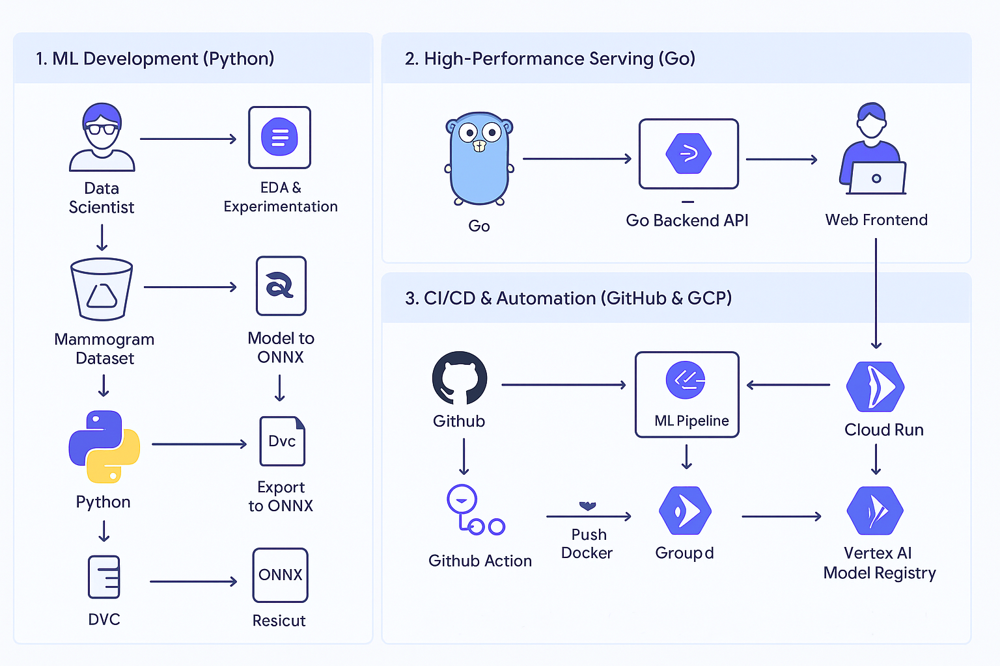

# MammoScan AI 🩺

[](https://github.com/josephed37/mammoscan-AI/actions/workflows/ci.yml) [](https://opensource.org/licenses/MIT)

An AI-powered application for breast cancer detection from mammogram images, built with a high-performance Go backend and a Python-based machine learning pipeline. This project is being built in public to document the end-to-end process of creating a production-ready MLOps system.

---

## ✨ Key Features

- **AI-Powered Prediction:** Uses a Convolutional Neural Network (CNN) to classify images.
- **High-Performance API:** A backend written in Go for fast, low-latency inference.
- **Automated MLOps:** Features a full CI/CD pipeline for automated testing, building, and deployment.
- **Zero-Cost Infrastructure:** Deployed entirely on the Google Cloud Platform free tier.

## 🏗️ Architecture

This project follows a modern MLOps architecture, separating the ML training, backend serving, and frontend components into distinct, containerized services.



## 🛠️ Tech Stack

- **Machine Learning:** Python, TensorFlow/Keras, DVC
- **Backend:** Go (Golang)
- **Frontend:** Streamlit
- **DevOps & MLOps:** Docker, GitHub Actions, Google Cloud Run, Google Cloud Build, Google Cloud Storage

## 🚀 Getting Started

To get a local copy up and running, follow these simple steps.

1. Clone the repo:

   ```sh
   git clone https://github.com/josephed37/mammoscan-AI.git
   ```

2. Navigate to the project directory:

   ```bash
   cd mammoscan-AI
   ```

   *(More instructions to be added later...)*

## 🗺️ Project Roadmap

You can follow the project's progress and see the full task list on our GitHub Project Board.

## 📄 License

This project is distributed under the MIT License. See `LICENSE` for more information.

---
